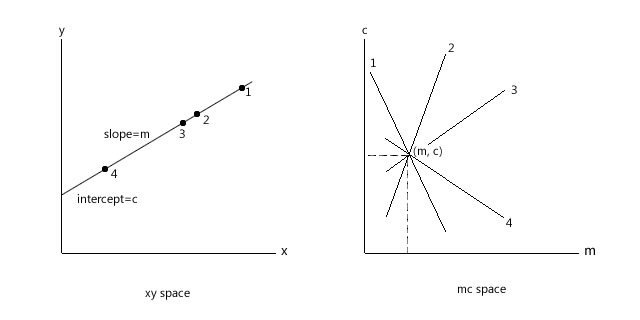

# Lane Lines Detection Python
### Step 1: Edge Detection
The Canny edge detector is an edge detection operator that uses a multi-stage algorithm to detect a wide range of edges in images. The Canny filter is a multi-stage edge detector. It uses a filter based on the derivative of a Gaussian in order to compute the intensity of the gradients.The Gaussian reduces the effect of noise present in the image. Then, potential edges are thinned down to 1-pixel curves by removing non-maximum pixels of the gradient magnitude. Finally, edge pixels are kept or removed using hysteresis thresholding on the gradient magnitude. The Canny has three adjustable parameters: the width of the Gaussian (the noisier the image, the greater the width), and the low and high threshold for the hysteresis thresholding.

<ol>
    <li>Apply Gaussian filter to smooth the image in order to remove the noise</li>
<li>Find the intensity gradients of the image</li>
<li>Apply non-maximum suppression to get rid of spurious response to edge detection</li>
<li>Apply double threshold to determine potential edges</li>
<li>Track edge by hysteresis: Finalize the detection of edges by suppressing all the other edges that are weak and not connected to strong edges.</li>
</ol>

```python
# https://www.youtube.com/watch?v=eLTLtUVuuy4
%matplotlib inline
import cv2
import numpy as np
import matplotlib.pyplot as plt

def canny(image):
    gray = cv2.cvtColor(image, cv2.COLOR_BGR2GRAY)
    blur = cv2.GaussianBlur(gray, (3,3), 0)
    canny = cv2.Canny(blur, 50,150)
    return canny

image = cv2.imread("images.jpg")
lane_image = np.copy(image)
canny = canny(lane_image)
plt.imshow(canny)
plt.show()
# cv2.waitKey(0)
```


### Step 2: Finding Region of Interest


```python
def region_of_interest(image):
#     image = cv2.cvtColor(image, cv2.COLOR_BGR2GRAY)
    height = image.shape[0]
    width = image.shape[1]
    triangle = np.array([[(100,height), (650, height), (400, 250), (340, 250)]])
    mask = np.zeros_like(image)
    cv2.fillPoly(mask, np.int32(triangle), 255)
    masked_image = cv2.bitwise_and(image, mask)
    return masked_image

# region_of_interest(canny)
cropped_image = region_of_interest(canny)
plt.imshow(cropped_image)
plt.show()
```


### Step 3: Finding Lane Lines using Hough Transform and Hough Space
This is very important step as it involves checking the intercept of lines, which may be in space of transformed line but separated.



```python
lines = cv2.HoughLinesP(cropped_image, 2, np.pi/180, 100, np.array([]), minLineLength=40, maxLineGap = 70)
```
Hough Transform perform straight lines iteration throughout image with 360 degree slopes to find the intercepts between lines and store it in array. You can arrange the values of minimum langth of hough line and minimum gap between lines.

### Step 4: Now To display lines
Since we now have lines parameters of slopes and intercepts. We can use these lines to make image from it.

```python
def displayLines(image, lines):
    line_image = np.zeros_like(image)
    if lines is not None:
        for line in lines:
            x1,y1,x2,y2 = line.reshape(4)
            cv2.line(line_image, (x1,y1),(x2,y2), (255,0,0), 10)
    return line_image
line_image = displayLines(lane_image, lines)
plt.imshow(line_image)
plt.show()
```


### Step 5: Combining the images
In the following, since we lines image as well as original image. We combine themto get the proper image with lines highlighted

```python
combo_image = cv2.addWeighted(lane_image, 0.8, line_image, 1, 1)
plt.imshow(combo_image)
cv2.imshow("",combo_image)
cv2.waitKey(0)
plt.show()
```


Step 6: Optimizations (Extra Step)
We can see that in the previous output. We get the lines but yet they are not aligned. So to optimize the result, we have the prarameters of slopes and intercepts of both lines combined. We store the individual slopes in separate array to make it easy for operation on them individually since there values of slopes are different, we have to handle them according to their slopes and interceots.

```python
def make_coordinates(image, line_parameters):
    slope, intercept = line_parameters
    y1 = image.shape[0]
    y2 = int(y1*(3/4))
    x1 = int((y1 - intercept)/slope)
    x2 = int((y2 - intercept)/slope)
    return np.array([x1,y1,x2,y2])
def average_slope_intercept(image, lines):
    left_fit=[]
    right_fit=[]
    for line in lines:
        x1,y1,x2,y2 = line.reshape(4)
#             cv2.line(line_image, (x1,y1),(x2,y2), (255,0,0), 10)
        parameter = np.polyfit((x1,x2), (y1,y2), 1)
        slope = parameter[0]
        intercept = parameter[1]
        if slope < 0:
            left_fit.append((slope,intercept))
        else:
            right_fit.append((slope,intercept))
    left_fit_average = np.average(left_fit, axis=0)
    right_fit_average = np.average(right_fit, axis=0)
    left_line = make_coordinates(image, left_fit_average)
    right_line = make_coordinates(image, right_fit_average)
    return np.array([left_line, right_line])
averaged_lines = average_slope_intercept(lane_image, lines)
line_image = displayLines(lane_image, averaged_lines)
combo_image = cv2.addWeighted(lane_image, 0.8, line_image, 1, 1)
plt.imshow(combo_image)
plt.show()
```


```python

```


```python

```
