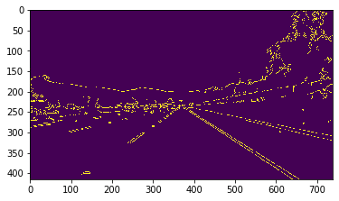
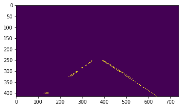
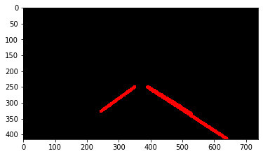
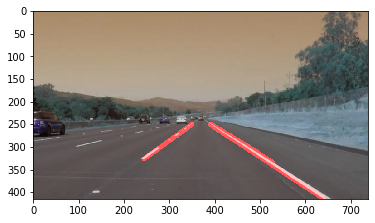
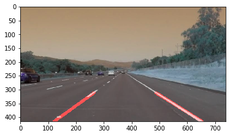

# Lane Lines Detection Python
### Step 1: Edge Detection
The Canny edge detector is an edge detection operator that uses a multi-stage algorithm to detect a wide range of edges in images. The Canny filter is a multi-stage edge detector. It uses a filter based on the derivative of a Gaussian in order to compute the intensity of the gradients.The Gaussian reduces the effect of noise present in the image. Then, potential edges are thinned down to 1-pixel curves by removing non-maximum pixels of the gradient magnitude. Finally, edge pixels are kept or removed using hysteresis thresholding on the gradient magnitude. The Canny has three adjustable parameters: the width of the Gaussian (the noisier the image, the greater the width), and the low and high threshold for the hysteresis thresholding.

```python
# https://www.youtube.com/watch?v=eLTLtUVuuy4
%matplotlib inline
import cv2
import numpy as np
import matplotlib.pyplot as plt

def canny(image):
    gray = cv2.cvtColor(image, cv2.COLOR_BGR2GRAY)
    blur = cv2.GaussianBlur(gray, (3,3), 0)
    canny = cv2.Canny(blur, 50,150)
    return canny

image = cv2.imread("images.jpg")
lane_image = np.copy(image)
canny = canny(lane_image)
plt.imshow(canny)
plt.show()
# cv2.waitKey(0)
```





Step 2: Finding Region of Interest


```python
def region_of_interest(image):
#     image = cv2.cvtColor(image, cv2.COLOR_BGR2GRAY)
    height = image.shape[0]
    width = image.shape[1]
    triangle = np.array([[(100,height), (650, height), (400, 250), (340, 250)]])
    mask = np.zeros_like(image)
    cv2.fillPoly(mask, np.int32(triangle), 255)
    masked_image = cv2.bitwise_and(image, mask)
    return masked_image

# region_of_interest(canny)
cropped_image = region_of_interest(canny)
plt.imshow(cropped_image)
plt.show()
```





Finding Lane Lines using Hough Transform and Hough Space


```python
lines = cv2.HoughLinesP(cropped_image, 2, np.pi/180, 100, np.array([]), minLineLength=40, maxLineGap = 70)
```

Now To display lines


```python
def displayLines(image, lines):
    line_image = np.zeros_like(image)
    if lines is not None:
        for line in lines:
            x1,y1,x2,y2 = line.reshape(4)
            cv2.line(line_image, (x1,y1),(x2,y2), (255,0,0), 10)
    return line_image
line_image = displayLines(lane_image, lines)
plt.imshow(line_image)
plt.show()
```





```python
combo_image = cv2.addWeighted(lane_image, 0.8, line_image, 1, 1)
plt.imshow(combo_image)
cv2.imshow("",combo_image)
cv2.waitKey(0)
plt.show()
```





```python
def make_coordinates(image, line_parameters):
    slope, intercept = line_parameters
    y1 = image.shape[0]
    y2 = int(y1*(3/4))
    x1 = int((y1 - intercept)/slope)
    x2 = int((y2 - intercept)/slope)
    return np.array([x1,y1,x2,y2])
def average_slope_intercept(image, lines):
    left_fit=[]
    right_fit=[]
    for line in lines:
        x1,y1,x2,y2 = line.reshape(4)
#             cv2.line(line_image, (x1,y1),(x2,y2), (255,0,0), 10)
        parameter = np.polyfit((x1,x2), (y1,y2), 1)
        slope = parameter[0]
        intercept = parameter[1]
        if slope < 0:
            left_fit.append((slope,intercept))
        else:
            right_fit.append((slope,intercept))
    left_fit_average = np.average(left_fit, axis=0)
    right_fit_average = np.average(right_fit, axis=0)
    left_line = make_coordinates(image, left_fit_average)
    right_line = make_coordinates(image, right_fit_average)
    return np.array([left_line, right_line])
averaged_lines = average_slope_intercept(lane_image, lines)
line_image = displayLines(lane_image, averaged_lines)
combo_image = cv2.addWeighted(lane_image, 0.8, line_image, 1, 1)
plt.imshow(combo_image)
plt.show()
```





```python

```


```python

```
